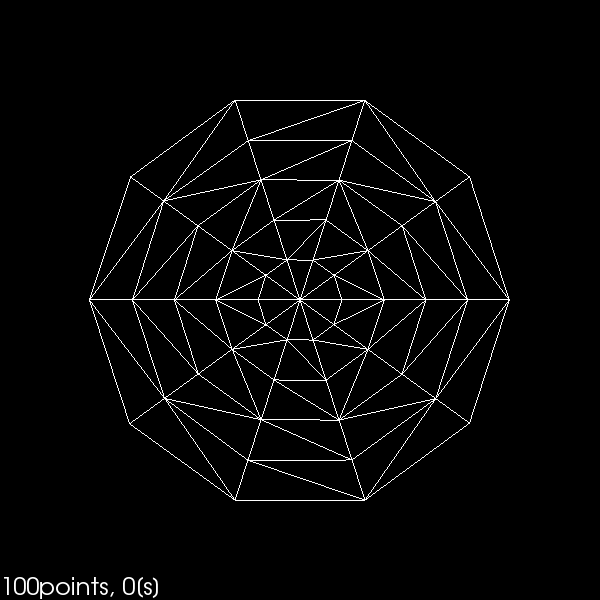
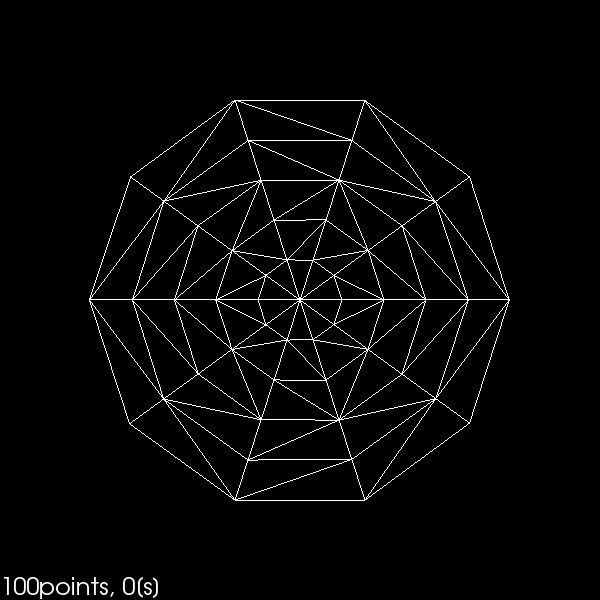
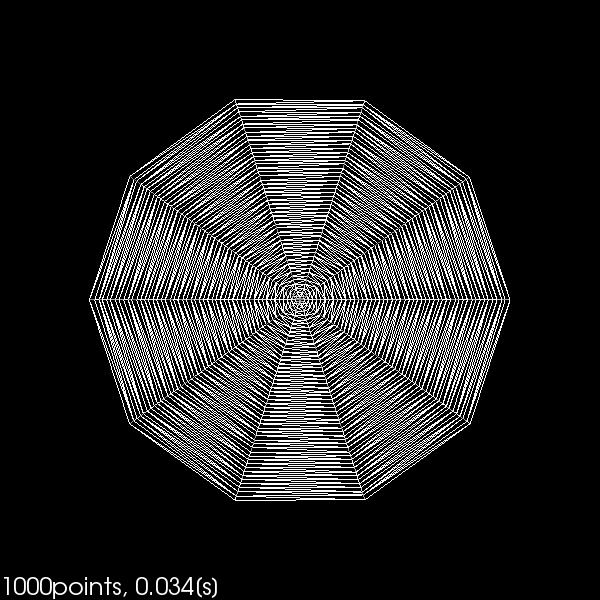
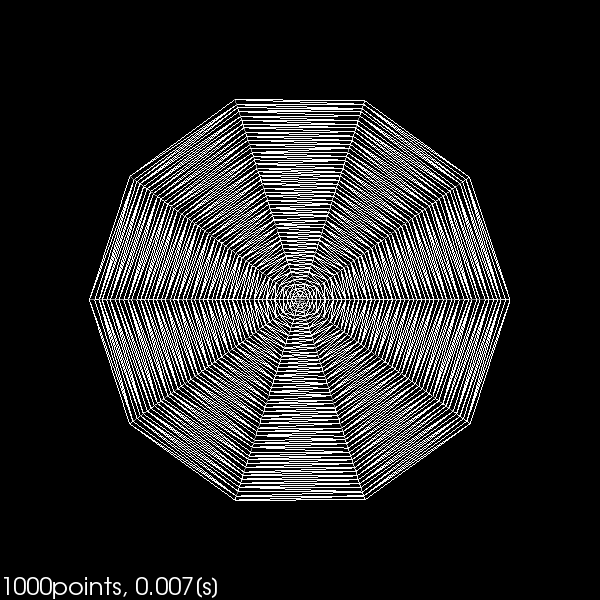
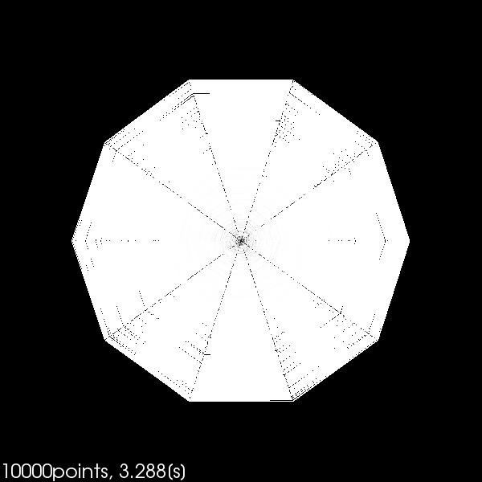
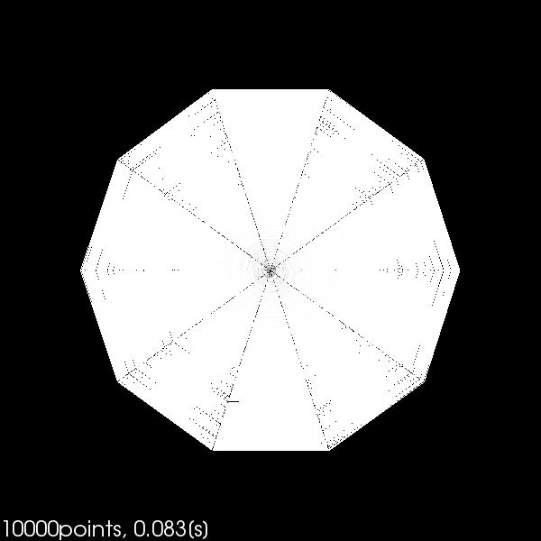
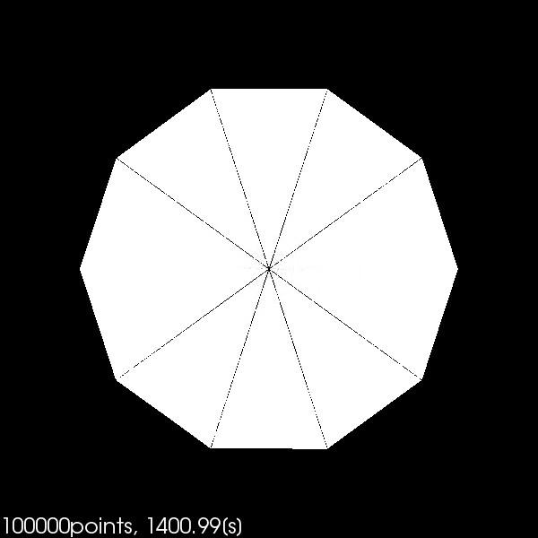
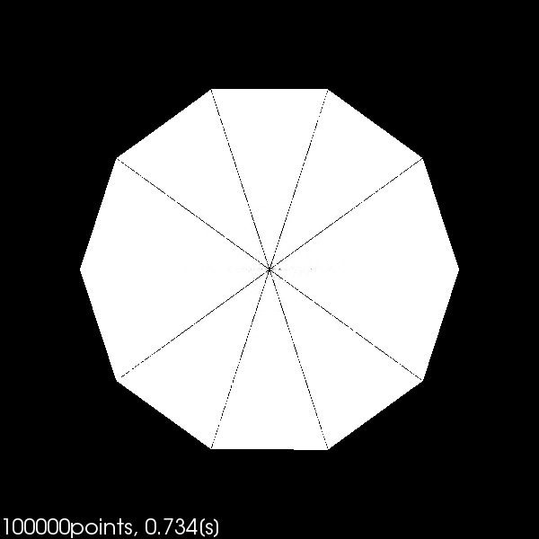

# Faster Delaunay2D for VTK

| Number&nbsp;of&nbsp;points | Conventional function        | Faster function              |
|:--------------------------:|:----------------------------:|:----------------------------:|
| 100                        |     |     |
| 1000                       |    |    |
| 10000                      |   |   |
| 100000                     |  |  |
